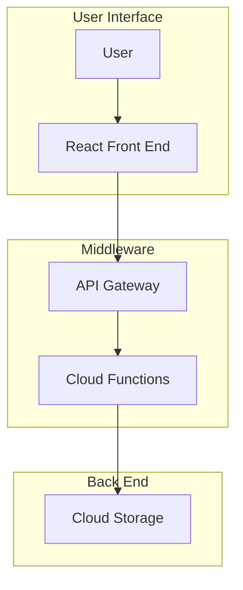
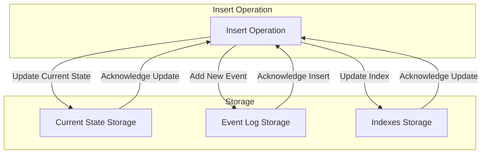
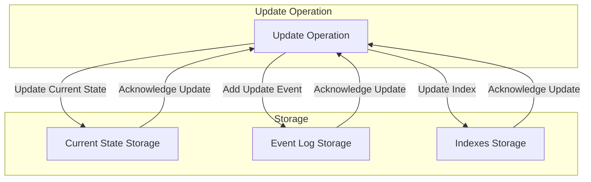
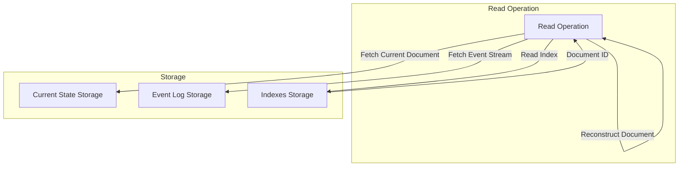
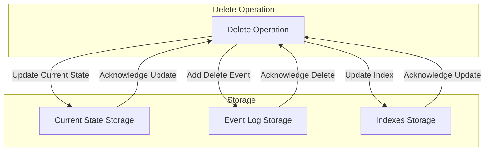

# Sandy CRM 🥐 

> Sandy is the personal assistant for small to medium consulting companies

Built with a modern stack, cloud ready, self hostable



## Storage Model

deployed on cloud storage (`s3`, `gcs`, `adls`, etc), implements the event sourcing pattern, storing the current state along with a change log for each entity, along with indexes to facilitate look ups and joins.  Folder structure is here:

```
org-name/
├── current/
│   ├── customers/
│   │   ├── customer_1.json.gz
│   │   ├── customer_2.json.gz
│   │   └── ...
│   ├── contacts/
│   │   ├── contact_1.json.gz
│   │   ├── contact_2.json.gz
│   │   └── ...
│   ├── opportunities/
│   │   ├── opportunity_1.json.gz
│   │   ├── opportunity_2.json.gz
│   │   └── ...
│   └── ...
├── eventlog/
│   ├── customers/
│   │   ├── customer_1/
│   │   │   ├── event_20220101T123456.json.gz
│   │   │   ├── event_20220102T123456.json.gz
│   │   │   └── ...
│   │   ├── customer_2/
│   │   │   ├── event_20220101T123456.json.gz
│   │   │   ├── event_20220102T123456.json.gz
│   │   │   └── ...
│   │   └── ...
│   ├── contacts/
│   │   ├── contact_1/
│   │   │   ├── event_20220101T123456.json.gz
│   │   │   ├── event_20220102T123456.json.gz
│   │   │   └── ...
│   │   └── ...
│   ├── opportunities/
│   │   ├── opportunity_1/
│   │   │   ├── event_20220101T123456.json.gz
│   │   │   ├── event_20220102T123456.json.gz
│   │   │   └── ...
│   │   └── ...
│   └── ...
├── indexes/
│   ├── customers.json.gz
│   ├── contacts.json.gz
│   ├── opportunities.json.gz
│   └── ...
```

### `insert` operations

The following diagram describes inserts into the model:



### `update` operations

The following diagram describes updates to entities in the model:



### `select` operations

The following diagram describes read operations:



### `delete` operations

The following diagram describes delete operations to entities in the model:


